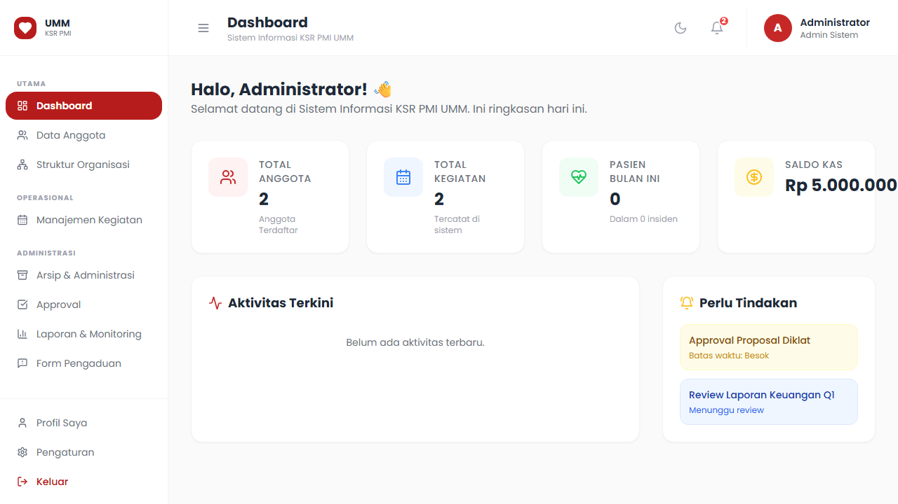
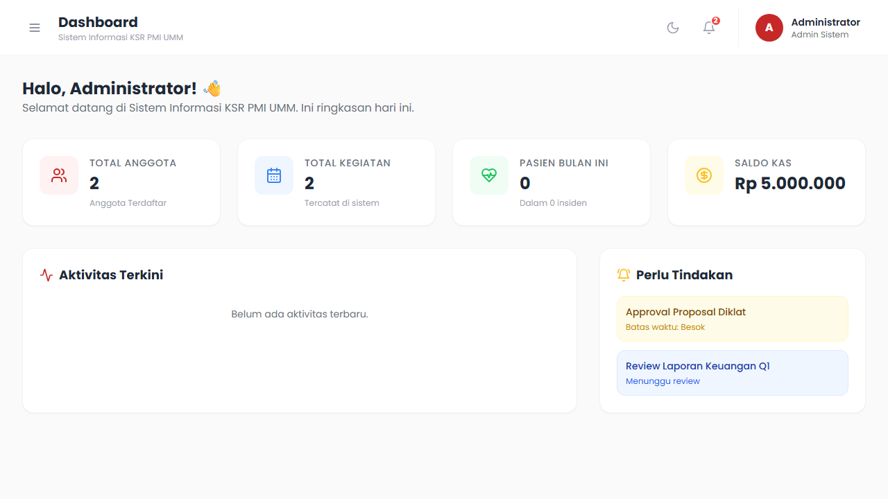
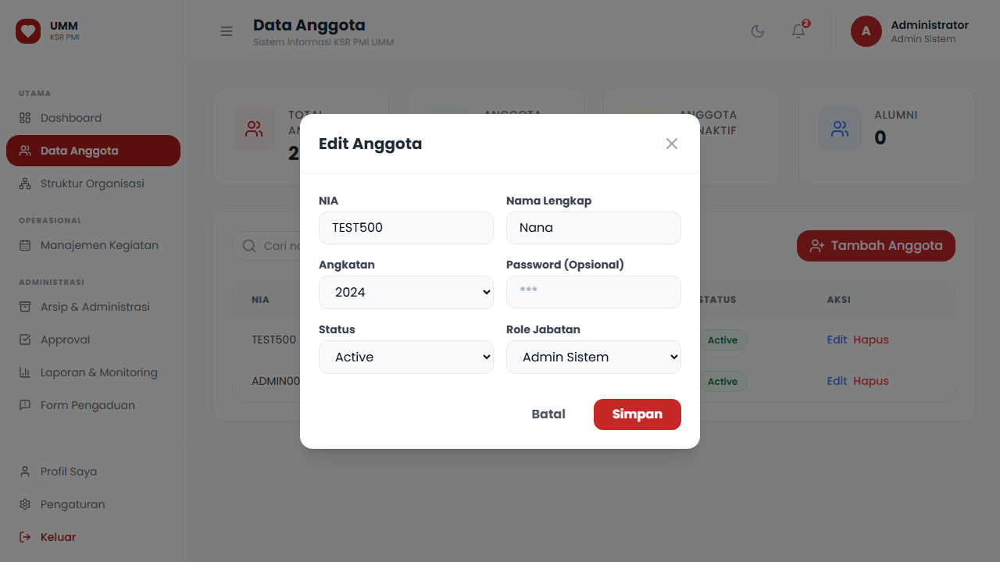
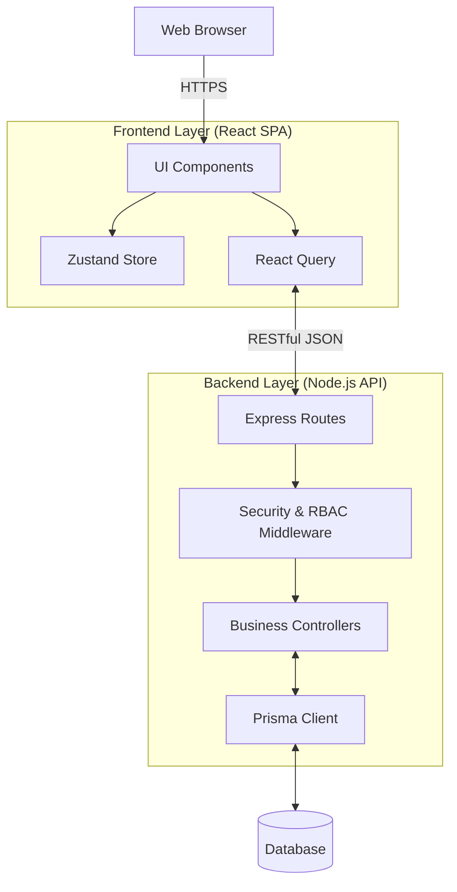

<div align="center">
  
  
  <br />
  <br />

  <h1>Sistem Informasi Manajemen</h1>
  <p><b>Platform Terpadu Administrasi, Pendataan, dan Operasional Lapangan <br/> Korps Sukarela PMI Unit Universitas Muhammadiyah Malang</b></p>
  
  <br />

  [](https://reactjs.org/)
  [](https://vitejs.dev/)
  [](https://www.typescriptlang.org/)
  [](https://tailwindcss.com/)
  [](https://nodejs.org/)
  [](https://prisma.io/)
  <br />
  [](https://github.com/Kira-IDN/sim-ksr-pmi-umm/actions/workflows/ci.yml)
  [](https://github.com/Kira-IDN/sim-ksr-pmi-umm/releases)
  [](#-license)

</div>

---

## 📖 Project Overview

Proyek ini dibangun untuk menggantikan sistem administrasi manual KSR PMI UMM dengan platform digital yang aman, terpusat, dan efisien. Sistem ini mencakup pengelolaan data keanggotaan secara komprehensif, pelacakan presensi kegiatan, pengarsipan dokumen digital, manajemen inventaris logistik, serta alur persetujuan (approval) berjenjang.

Proyek ini telah menyelesaikan fase **Frontend MVP (v1.0.0)** yang merupakan fondasi antarmuka dan *state management* modern sebelum dihubungkan dengan API Backend.

---

## 📸 Screenshots

Semua tangkapan layar di bawah ini dirender secara langsung dari antarmuka aplikasi.

| Dashboard & Analitik | Manajemen Data Anggota |
| :---: | :---: |
|  |  |
  
| Sidebar (Desktop Terbuka) | Sidebar (Desktop Tertutup) |
| :---: | :---: |
|  |  |

| Profil Pengguna | Detail Anggota Modal |
| :---: | :---: |
|  |  |
  
| Pengaturan Sistem | Responsif Mobile (Drawer) |
| :---: | :---: |
|  |  |

> **Catatan**: Halaman Autentikasi tersedia pada file [screenshot_login.png](./docs/assets/screenshot_login.png).

---

## ✨ Feature Overview (Frontend MVP)

Berikut adalah daftar fitur utama yang tersedia dan disimulasikan secara lokal pada rilis *Frontend MVP*:

- **Identity & Access Management (IAM)**: Halaman Login responsif dengan proteksi rute klien berbasis JWT *Mock*.
- **Dashboard & Analitik**: Panel indikator ringkasan statistik anggota, metrik kegiatan, dan pemberitahuan persetujuan.
- **Manajemen Data Anggota**: Fungsionalitas CRUD lengkap untuk informasi anggota, didukung tabel dinamis dengan fitur *sorting* dan *filtering*.
- **Profil & Pengaturan**: Halaman pengaturan preferensi (seperti preferensi Tema dan Visibilitas Notifikasi) serta pratinjau profil *read-only*.
- **Collapsible Responsive Sidebar**: Tata letak modern dengan Sidebar yang dapat diciutkan (ditekan melalui *Hamburger Menu*) untuk memaksimalkan area konten, didukung animasi transisi *smooth*. Pada layar perangkat *Mobile*, navigasi otomatis berubah menjadi *Drawer Overlay*.
- **Navigasi Berbasis Role (RBAC)**: Top Navbar dan Sidebar yang secara otomatis menyesuaikan tampilan berdasarkan peran (Role) pengguna aktif.
- **Design System & Dark Mode**: Skema warna korporat KSR PMI UMM terintegrasi secara semantik dengan utilitas Tailwind CSS, dilengkapi dukungan mode gelap presisten.

---

## 🏗 System Architecture

Proyek ini menggunakan arsitektur *Client-Server* modern yang sepenuhnya memisahkan lapisan penyajian visual (Frontend) dari lapisan pemrosesan bisnis dan manipulasi data (Backend API).



---

## 🔐 Role-Based Access Control (RBAC)

Aplikasi memiliki tingkat proteksi yang ketat berdasarkan daftar peran (*Role*) berikut:

1. **Administrator**: Memiliki hak akses penuh (Superuser) untuk memanipulasi keseluruhan data organisasi serta mengelola akun dan konfigurasi sistem.
2. **Ketua Umum & Wakil**: Pengawas tingkat atas dengan hak pemantauan keseluruhan laporan dan *Approval* akhir.
3. **Sekretaris**: Pengelola pusat arsip, administrasi dokumen, dan pendataan riwayat presensi.
4. **Bendahara**: Pemegang otorisasi manajemen keuangan, arus kas, dan *Financial Approval*.
5. **Pengurus Bidang**: Pengelola spesifik modul Inventaris dan Buku Tamu.
6. **Pengurus Lapangan**: Penanggung jawab input dan laporan kegiatan lapangan serta manajemen pasien/korban harian.
7. **Anggota**: Visibilitas baca pada profil individu, histori kegiatan pribadi, dan hierarki Struktur Organisasi.

---

## 🛠 Tech Stack

**Frontend (Client)**
- **Framework**: React 18 (dikompilasi dengan Vite 5)
- **Bahasa**: TypeScript 5
- **Styling**: Tailwind CSS 3.4 (dengan integrasi `clsx` & `tailwind-merge`)
- **State Management**: Zustand (State Global UI) & React Query v5 (Sinkronisasi Server)
- **Forms**: React Hook Form (terintegrasi dengan validasi skema Zod)
- **Aset UI**: Lucide React Icons & Radix UI Primitives

**Backend (Dalam Pengembangan)**
- **Framework**: Node.js dengan Express.js
- **ORM & Database**: Prisma ORM, SQLite untuk *development*, PostgreSQL disarankan untuk *production*
- **Keamanan**: `bcrypt` untuk pelindung *password*, JSON Web Tokens (`jsonwebtoken`) untuk sesi.

---

## 📁 Folder Structure

```text
sim-ksr-pmi-umm/
├── .github/                  # Konfigurasi Continuous Integration (CI) dan Issue Templates
├── docs/                     # Dokumentasi sistem, rilis, arsitektur, dan screenshot assets
├── server/                   # Backend Node.js Environment
│   ├── prisma/               # File skema database (.prisma) dan skrip Seeder
│   └── src/
│       ├── controllers/      # Modul logika aplikasi
│       ├── middlewares/      # Penengah otorisasi akses (RBAC) dan Error Handler
│       └── routes/           # Penentuan struktur endpoint API
└── src/                      # Frontend React Environment
    ├── components/           # Kumpulan UI (Buttons, Cards, Modals) & Layout Utama
    ├── constants/            # Matriks otorisasi pengguna & Role configuration
    ├── pages/                # Halaman aplikasi berdasarkan router (Dashboard, Auth, Anggota)
    ├── store/                # Konfigurasi manajemen status (Zustand & Slices)
    └── utils/                # Fungsi bantu (Instansi Axios, kalkulator tanggal, dll.)
```

---

## 📦 Installation & Development

Pastikan sistem Anda telah memiliki **Node.js (versi 18 ke atas)** beserta instalasi NPM atau Yarn.

### 1. Kloning Repositori

```bash
git clone https://github.com/Kira-IDN/sim-ksr-pmi-umm.git
cd sim-ksr-pmi-umm
```

### 2. Konfigurasi Frontend (Klien)

Jalankan perintah ini pada *root directory* untuk membangun Frontend:

```bash
npm install
npm run dev
```

Klien akan dilayani pada alamat lokal `http://localhost:5173`.

### 3. Konfigurasi Backend (Server)

Buka sesi terminal baru dan navigasi ke ruang kerja peladen:

```bash
cd server
npm install
npx prisma db push
npx ts-node prisma/seed.ts
npm run dev
```

*Backend API* akan mengamati (listen) *port* 3000 pada mesin Anda (`http://localhost:3000`).
> **Akses Kredensial Pengujian:** Anda dapat mengakses aplikasi dengan kredensial Administrator menggunakan Nama Induk Anggota (NIA): `ADMIN001` dengan password `admin123`.

---

## 🛤 Backend Roadmap

Fokus pengembangan berlanjut pada pengkabelan Frontend ke *Production API* yang direpresentasikan oleh Roadmap berikut:

1. **Integrasi IAM (Sprint 9)**: Penyediaan endpoint otentikasi login, JWT, manajemen otorisasi peran (RBAC), serta modifikasi basis profil.
2. **Core System (Sprint 10)**: Dukungan *Restful* untuk fitur CRUD Data Anggota, Struktur Organisasi, dan Manajemen Kegiatan Harian.
3. **Persuratan & Approval (Sprint 11)**: Pembangunan alur persetujuan berbasis *state-machine* pada modul Administrasi dan Keuangan.
4. **Logistik (Sprint 12)**: Otomasi kalkulasi dan riwayat inventaris.

---

## 🤝 Contribution

Repositori ini mengikuti standar *Semantic Versioning* dan *Conventional Commits*. Silakan periksa file [CONTRIBUTING.md](./CONTRIBUTING.md) kami yang menjabarkan tentang konvensi pembuatan *Branch*, penulisan *Commit*, tata cara laporan masalah (Issues), hingga pembukaan *Pull Requests* (PR).

---

## 📄 License

Sistem ini dikembangkan secara spesifik untuk lingkungan internal organisasi KSR PMI Unit Universitas Muhammadiyah Malang. 
Hak Cipta © 2026 **KSR PMI UMM**. Hak cipta dilindungi undang-undang. Dilarang melakukan komersialisasi atau redistribusi perangkat lunak tanpa persetujuan tertulis.
