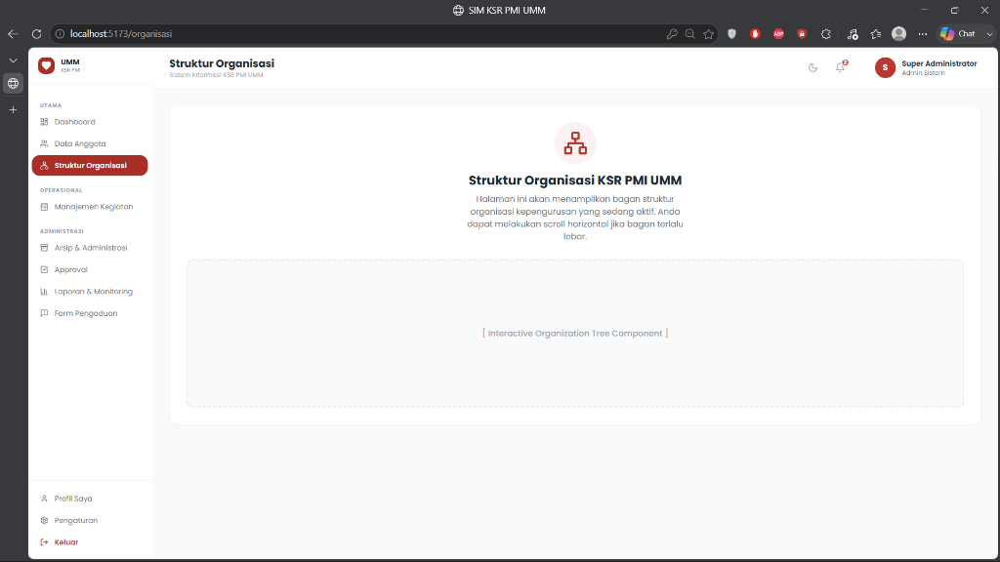
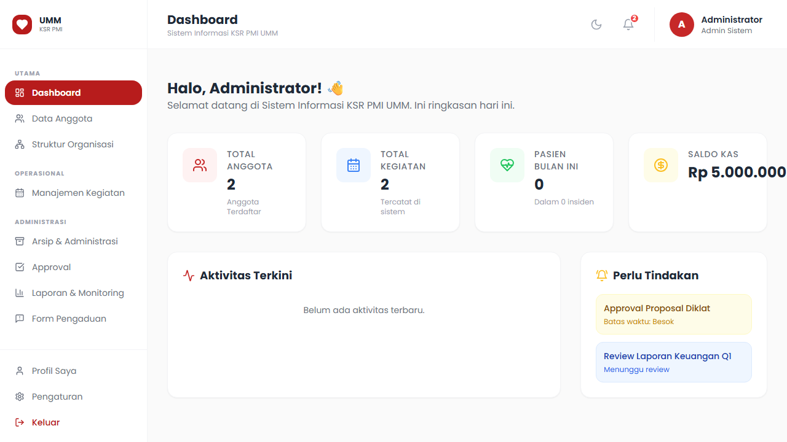
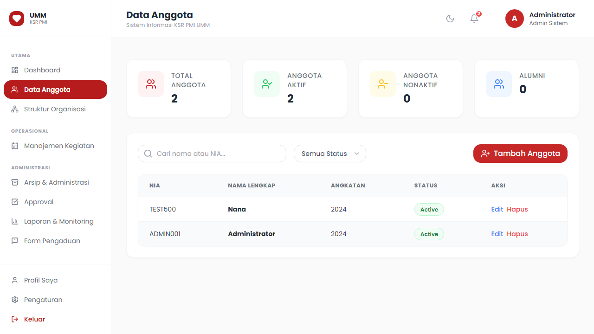
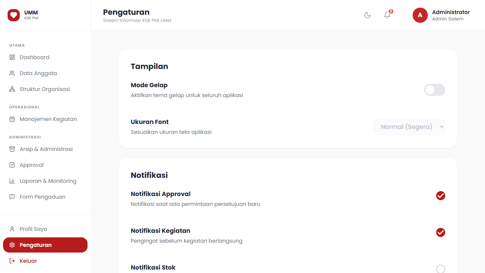
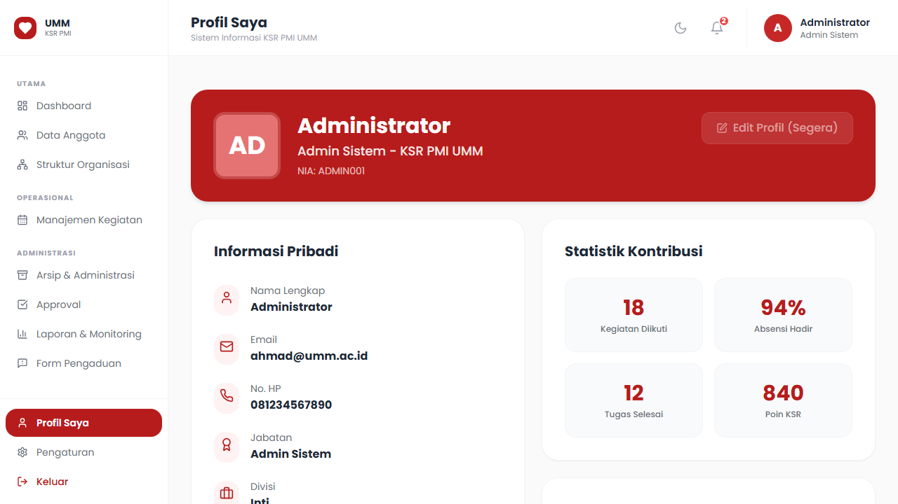
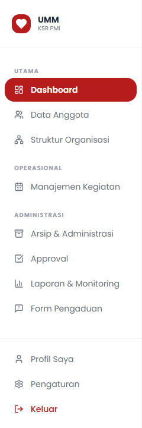
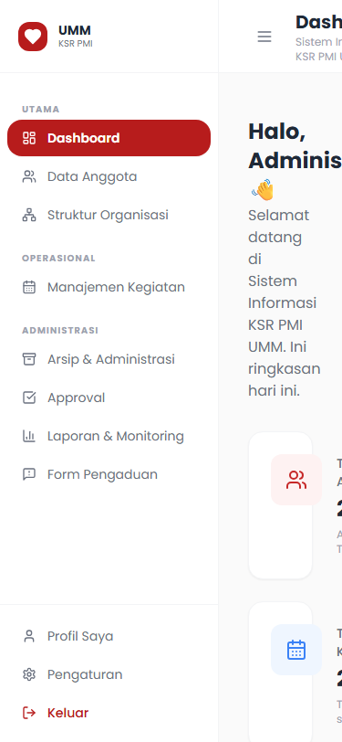
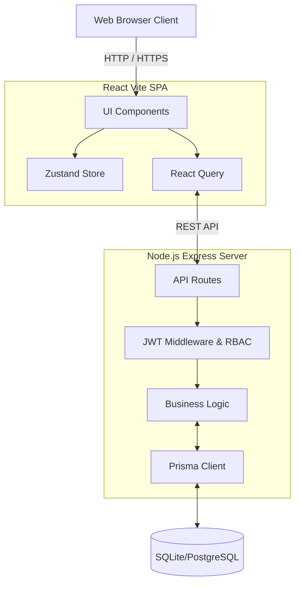

<div align="center">
  
  
  <br />
  <br />

  [](https://github.com/Kira-IDN/sim-ksr-pmi-umm/actions/workflows/ci.yml)
  [](https://reactjs.org/)
  [](https://vitejs.dev/)
  [](https://www.typescriptlang.org/)
  [](https://tailwindcss.com/)
  [](https://nodejs.org/)
  [](https://prisma.io/)
  [](#-lisensi)

  <h3>Sistem Informasi Manajemen - KSR PMI UMM</h3>
  <p>Platform terpadu untuk memodernisasi administrasi, pendataan, dan operasional lapangan Korps Sukarela PMI Unit Universitas Muhammadiyah Malang.</p>
</div>

---

## 📖 Tentang Proyek

Proyek ini dibangun untuk menggantikan sistem administrasi manual KSR PMI UMM dengan platform digital yang aman, efisien, dan berskala besar. Sistem ini mencakup pengelolaan data keanggotaan, rekapitulasi presensi, pengarsipan dokumen digital, manajemen inventaris, dan alur persetujuan (approval) berjenjang.

## 📸 Tangkapan Layar (Screenshots)

<details>
  <summary><b>Klik untuk melihat tampilan aplikasi</b></summary>
  <br/>
  
  > *Tangkapan layar asli dari aplikasi web berjalan.*

  | Dashboard | Manajemen Anggota |
  | :---: | :---: |
  |  |  |
  
  | Pengaturan Sistem | Profil Pengguna |
  | :---: | :---: |
  |  |  |
  
  | Sidebar Navigasi | Tampilan Mobile |
  | :---: | :---: |
  |  |  |
</details>

---

## 🏗 Arsitektur Sistem

Proyek ini menggunakan arsitektur *Client-Server* modern dengan pemisahan tugas yang jelas antara *Frontend* dan *Backend API*.



---

## 🚀 Status & Roadmap Pengembangan

- [x] **Fase 1: Frontend MVP & Design System** (Saat ini)
  - Autentikasi UI, Dashboard UI, Data Anggota CRUD UI, Profil, Dark Mode, RBAC Static Matrix.
- [ ] **Fase 2: Backend Integration & IAM (Sprint 9)** 
  - JWT Authentication, Users API, Roles Configuration.
- [ ] **Fase 3: Core API (Sprint 10)**
  - Organization Structure API, Activities & Attendance API.
- [ ] **Fase 4: Financial & Approval API (Sprint 11)**
  - Inventory, Cash Management, Approval Workflow.

### Fitur Tersedia di Frontend MVP:
- **Autentikasi (IAM)**: Halaman Login responsif dengan proteksi rute berbasis JWT (disimulasikan di frontend).
- **Dashboard & Analitik**: Panel ringkasan data statistik anggota, kegiatan, dan notifikasi persetujuan (dark mode didukung).
- **Manajemen Data Anggota**: CRUD lengkap (Create, Read, Update, Delete) informasi anggota, form validasi dengan Zod, dan tabel dengan filter dinamis.
- **Profil & Pengaturan**: Halaman Read-Only profil dan Pengaturan Tema/Notifikasi, terisolasi sesuai hak akses.
- **Navigasi Dinamis**: Top Navbar & Sidebar Responsif yang otomatis merender menu berdasarkan *Role* pengguna.
- **Design System & Dark Mode**: Implementasi warna sesuai *brand guidelines* KSR PMI UMM dengan integrasi *Dark Mode* persisten (`Zustand` + `localStorage`).

---

## 🔐 Sistem Hak Akses (RBAC)

Aplikasi ini menggunakan sistem **Role-Based Access Control (RBAC)** ketat untuk menjaga kerahasiaan data organisasi.

**Daftar Role Utama:**
1. **Administrator**: Akses penuh (CRUD) ke seluruh modul dan Pengaturan (pusat manajemen akun).
2. **Ketua Umum & Wakil**: Visibilitas penuh terhadap pelaporan, manajemen kegiatan, dan hak *Approval* umum.
3. **Sekretaris**: Menguasai modul Arsip & Administrasi, Rekap Laporan, dan Absensi Digital.
4. **Bendahara**: Menguasai modul Keuangan dan *Financial Approval*.
5. **Pengurus Bidang**: Akses khusus Inventaris, Buku Tamu, dan Data Anggota.
6. **Pengurus Kegiatan Lapangan**: Manajemen Kegiatan dan Data Pasien/Korban.
7. **Anggota Organisasi**: Visibilitas terbatas pada Struktur Organisasi, Absensi, dan Profil Pribadi.

---

## 🛠 Tech Stack Lengkap

**Frontend (Client):**
- **Core**: React 18 (Vite), TypeScript 5
- **Styling**: Tailwind CSS + `clsx` & `tailwind-merge`
- **State Management**: Zustand (Global UI State), React Query (Async Server State)
- **Forms & Validation**: React Hook Form + Zod
- **Icons & UI**: Lucide React, Radix UI

**Backend (API):**
- **Core**: Node.js, Express.js
- **Database ORM**: Prisma ORM
- **Database Engine**: SQLite (Development) -> PostgreSQL (Production)
- **Security**: bcrypt (Hashing), jsonwebtoken (JWT Auth)

---

## 📁 Struktur Direktori

```text
sim-ksr-pmi-umm/
├── .github/                  # Konfigurasi GitHub Actions CI & Issue Templates
├── docs/                     # Dokumentasi teknis dan laporan QA proyek
├── server/                   # Backend API Node.js/Express
│   ├── prisma/               # Skema Database & Seeders
│   └── src/
│       ├── controllers/      # Logika bisnis API
│       ├── middlewares/      # Interceptor (Auth, RBAC, Error Handler)
│       └── routes/           # Definisi endpoint API
└── src/                      # Frontend React (Vite) Aplikasi Utama
    ├── components/           # Komponen UI Reusable (Cards, UI, Layouts)
    ├── constants/            # Variabel konstan (RBAC Matrix, Role config)
    ├── pages/                # Komponen Halaman (Dashboard, Login, dll)
    └── store/                # Konfigurasi Global State (Zustand)
```

---

## 📦 Panduan Instalasi (Development)

**Prasyarat:** Node.js (v18+) dan npm/yarn terpasang di sistem.

1. **Kloning Repositori:**
   ```bash
   git clone https://github.com/Kira-IDN/sim-ksr-pmi-umm.git
   cd sim-ksr-pmi-umm
   ```

2. **Setup Frontend:**
   ```bash
   npm install
   npm run dev
   ```
   *Frontend berjalan di `http://localhost:5173`.*

3. **Setup Backend (API Server):**
   ```bash
   cd server
   npm install
   npx prisma db push
   npx ts-node prisma/seed.ts   # Memasukkan data dummy & akun Administrator
   npm run dev
   ```
   *Backend berjalan di `http://localhost:3000`.*

> **Catatan Login:** Gunakan akun `ADMIN001` dengan password `admin123` untuk login sebagai Administrator.

---

## 🤝 Kontribusi

Kami menyambut baik segala bentuk kontribusi. Silakan baca [Panduan Kontribusi](CONTRIBUTING.md) untuk memahami *workflow* pembuatan *branch*, penulisan *commit message*, dan prosedur *Pull Request*.

## 📄 Lisensi

Hak Cipta © 2026 KSR PMI UMM.
Dikembangkan secara eksklusif untuk kebutuhan internal KSR PMI UMM. Hak cipta dilindungi.
